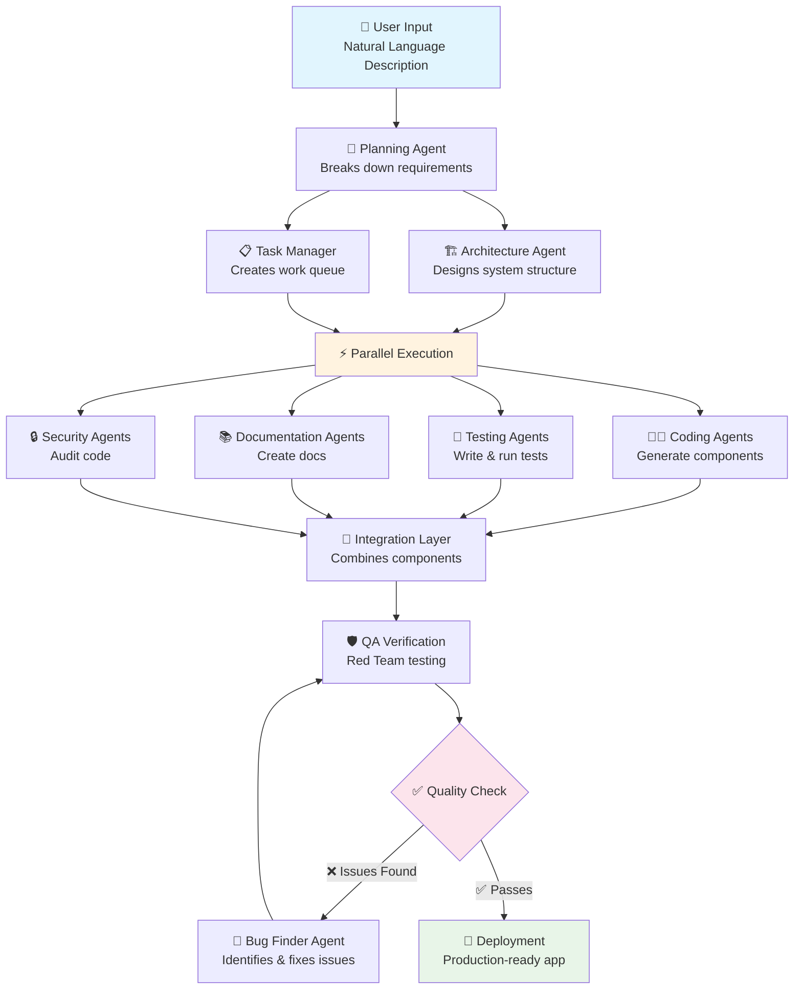

# Prometheus Swarm

> **The next evolution in AI development** - Moving from single-agent limitations to specialized AI swarms that build production-ready software from natural language descriptions.

[](https://github.com/Prometheus-Swarm)
[](https://prometheusswarm.ai)
[](https://discord.gg/koii)

## 🚀 What is Prometheus Swarm?

Prometheus Swarm represents a **paradigm shift in AI-powered development** - from single-agent limitations to coordinated swarms of specialized AI agents. Built on Koii's decentralized network of 100,000+ community nodes, it transforms natural language descriptions into production-ready applications through collaborative AI intelligence.

### The Industrial Revolution for AI Development

Where ChatGPT is like a lone craftsman, Prometheus Swarm is a modern software factory:

- **🏭 Division of Labor** - Specialized agents focus on what they do best (planning, coding, testing, documentation)
- **⚙️ Assembly Line Efficiency** - Work flows seamlessly from ideation to deployment
- **🔍 Quality Control** - Dedicated testing and review processes ensure reliable output
- **📈 Infinite Scalability** - Add more agents to handle larger projects without quality degradation

### How Prometheus Swarm Works



### Beyond "Vibe Coding" to Reliable Production

Traditional AI coding with ChatGPT often results in "vibe coding" - code that looks right but fails in practice. Prometheus Swarm eliminates this through:

1. **🎯 Narrowly-Scoped Tasks** - Complex projects broken into clear, unambiguous pieces
2. **🔗 Knowledge Integration** - `.kno` embeddings allow unlimited context sharing between agents
3. **🔄 Iterative Refinement** - Continuous testing and improvement cycles
4. **👥 Multi-Perspective Validation** - Different agents catch different types of errors
5. **📊 Transparent Process** - Git-based workflow with visible commits and pull requests

### Real-World Impact

The difference isn't theoretical - Prometheus Swarm delivers measurable results:

- **⚡ 95% Development Time Reduction** - 6-hour projects completed in ~5 minutes
- **🏆 1000+ PRs Shipped** in 3 days across decentralized nodes
- **🤝 50+ Partner Integrations** within weeks of launch
- **💼 Enterprise Adoption** - "You actually get something that works pretty much every time"

### Why Swarms Beat Single LLMs

| ChatGPT & Traditional LLMs | Prometheus Swarm |
|----------------------------|------------------|
| ❌ Context limitations & sequential processing | ✅ Unlimited context & parallel processing |
| ❌ Jack-of-all-trades compromising quality | ✅ Specialized agents for each task |
| ❌ Error-prone "hallucinations" | ✅ Cross-verification & fact-checking |
| ❌ Opaque black-box process | ✅ Transparent Git-based workflow |

## ⚡ Quick Start

```bash
# Install the framework
pip install prometheus-swarm

# Basic usage
from prometheus_swarm.clients import AnthropicClient
from prometheus_swarm.workflows import BaseWorkflow

client = AnthropicClient()
workflow = BaseWorkflow(config)
result = workflow.run()
```

## 🎯 Key Features

- **🔥 95% Development Time Reduction** - From hours to minutes
- **🌐 Decentralized Computing** - Powered by 100,000+ Koii network nodes
- **🤖 Specialized AI Agents** - Purpose-built for planning, coding, testing
- **🔄 Parallel Processing** - Multiple agents work simultaneously
- **✅ Built-in Quality Assurance** - Automated testing and verification
- **📖 Open Source** - Fully transparent and community-driven

## 🛠️ Core Components

- **Prometheus Swarm** - Main orchestration framework
- **Feature Builder Agent** - Code generation and project management
- **Bug Finder Agent** - Automated bug detection and security scanning
- **Documentation Agent** - Automated docs generation
- **Prometheus Test** - Comprehensive testing framework

## 📚 Documentation

- [Introduction](./introduction/) - Why AI swarms beat ChatGPT
- [How It Works](./how-it-works/) - Architecture and usage process
- [Guides](./guides/) - For creators, developers, and enterprise
- [About](./about/) - Origin story and vision

## 🌟 Real Results

- **1000+ PRs** shipped in 3 days
- **50+ Partner Projects** within weeks of launch
- **Enterprise-Grade Reliability** - Production-ready code every time

## 🤝 Community & Support

- **GitHub**: [Prometheus-Swarm Organization](https://github.com/Prometheus-Swarm)
- **Documentation**: [prometheusswarm.ai](https://prometheusswarm.ai)
- **Discord**: [Join the Koii Community](https://discord.gg/koii)

## 📄 License

Open source - see individual repositories for specific licenses.

---

**Stop copying code snippets from ChatGPT and hoping they work.** Experience the power of an AI swarm that builds complete, tested, production-ready applications on your behalf.
